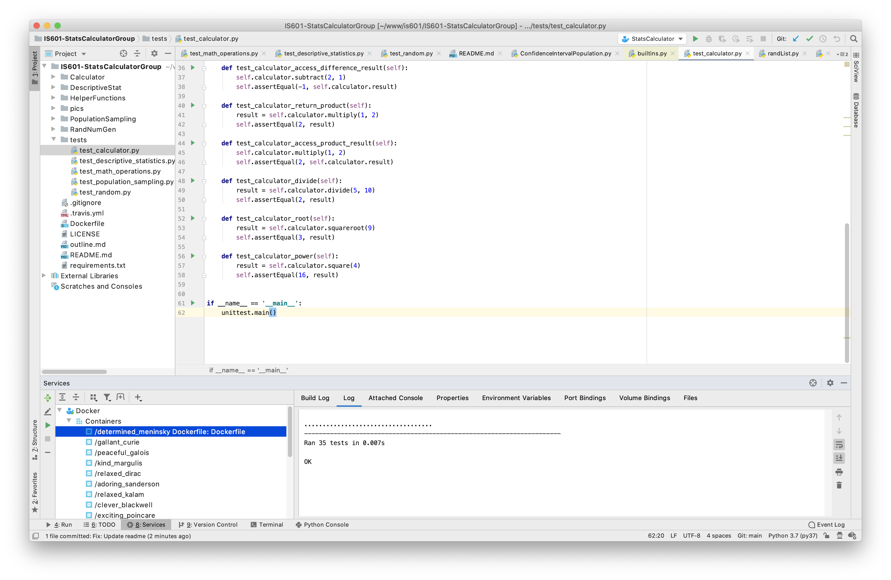

# IS601-StatsCalculatorGroup

* [Project outline](outline.md)
* [Project task list](https://github.com/Woffee/IS601-StatsCalculatorGroup/projects/1)

## Team members and contributions: 

 * [Wenbo Wang](https://github.com/Woffee/)
    * Outline and Project board 
    * Calculator Object
    * Basic math operations
    * Population Sampling functions
    * Additional Modules - Helper functions
    * Unit tests
 * [Arpit Rai](https://github.com/DanishBread/)
    * Task lists
    * Random Generator functions
    * Descriptive Statistics functions
    * Additional Modules - Random Number Generator
